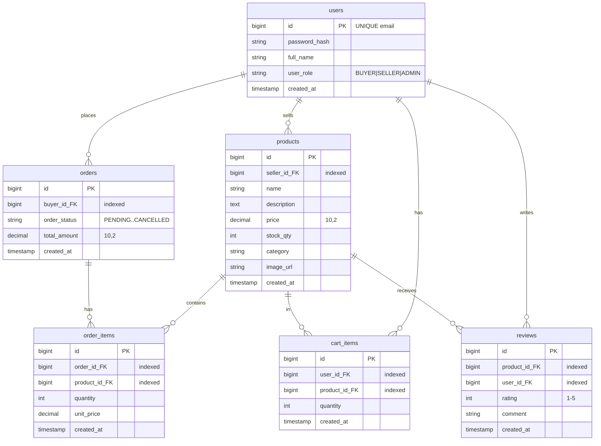

# D1 ER diagram (Mermaid) — mirrors V1__init_schema.sql

```mermaid
erDiagram
  users ||--o{ products : sells
  users ||--o{ orders : places
  users ||--o{ cart_items : has
  users ||--o{ reviews : writes
  products ||--o{ order_items : contains
  products ||--o{ cart_items : in
  products ||--o{ reviews : receives
  orders ||--o{ order_items : has
  users { bigint id PK "UNIQUE email" string password_hash string full_name string user_role "BUYER|SELLER|ADMIN" timestamp created_at }
  products { bigint id PK bigint seller_id_FK "indexed" string name text description decimal price "10,2" int stock_qty string category string image_url timestamp created_at }
  orders { bigint id PK bigint buyer_id_FK "indexed" string order_status "PENDING..CANCELLED" decimal total_amount "10,2" timestamp created_at }
  order_items { bigint id PK bigint order_id_FK "indexed" bigint product_id_FK "indexed" int quantity decimal unit_price timestamp created_at }
  cart_items { bigint id PK bigint user_id_FK "indexed" bigint product_id_FK "indexed" int quantity timestamp created_at }
  reviews { bigint id PK bigint product_id_FK "indexed" bigint user_id_FK "indexed" int rating "1-5" string comment timestamp created_at }
```
