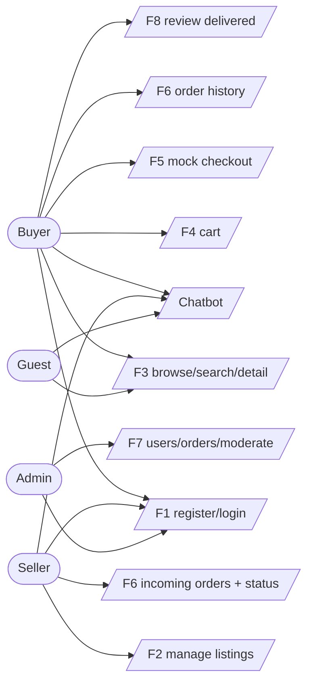

# D2 Use-case diagram (Mermaid) — F1–F8

```mermaid
flowchart LR
  Buyer([Buyer]) --> F1[/F1 register/login/]
  Seller([Seller]) --> F1
  Admin([Admin]) --> F1
  Buyer --> F3[/F3 browse/search/detail/]
  Guest([Guest]) --> F3
  Seller --> F2[/F2 manage listings/]
  Buyer --> F4[/F4 cart/]
  Buyer --> F5[/F5 mock checkout/]
  Buyer --> F6B[/F6 order history/]
  Seller --> F6S[/F6 incoming orders + status/]
  Admin --> F7[/F7 users/orders/moderate/]
  Buyer --> F8[/F8 review delivered/]
  Buyer --> CHAT[/Chatbot/]
  Seller --> CHAT
  Guest --> CHAT
```
Actors: Buyer, Seller, Admin (+Guest browsing). AuthFilter enforces roles server-side.
